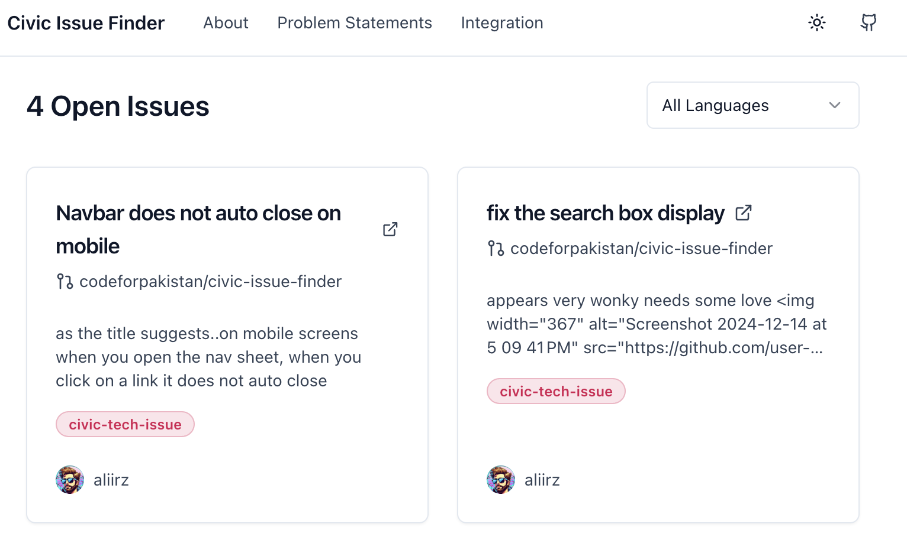

# Civic Issue Finder

A modern take on Code for America's original Civic Issue Finder. This tool helps connect developers with meaningful civic tech opportunities by aggregating GitHub issues labeled as `civic-tech-issue`.



## Features

- 🔍 Browse open civic tech issues from GitHub
- 🏷️ Filter by programming language
- 📱 Responsive design for all devices
- 🌙 Dark mode support
- 🔌 Embeddable widget for other websites
- 🚀 Built with modern web technologies
- 📊 API for integrating into other applications

## Getting Started

### Prerequisites

- Node.js 18+
- GitHub Personal Access Token
- Airtable account (for problem statements)

### Installation

1. Clone the repository:

```bash
git clone https://github.com/your-repo/civic-issue-finder.git
cd civic-issue-finder
```

2. Install dependencies:
```bash
npm install
```

3. Create a `.env.local` file with the following variables:

```
NEXT_PUBLIC_APP_URL=http://localhost:3000
GH_PAT=your_github_pat
AIRTABLE_PAT=your_airtable_pat
AIRTABLE_BASE_ID=your_base_id
```

4. Run the development server:

```bash
npm run dev
```

5. Open your browser and navigate to `http://localhost:3000` to see the app in action.

### Embedding

To embed the issue finder on your website, use the provided embed code. You can customize the height and theme (light or dark) using the URL parameters.

```html
<iframe src="https://civicissuefinder.codeforpakistan.org/embed" width="100%" height="500px"></iframe>
```

### API

The API is available at `https://civicissuefinder.codeforpakistan.org/api/v1/issues`. It returns a JSON object with the issues, including pagination support.

```bash
Get civic tech issues
GET /api/v1/issues


Query parameters
?page=1 # Page number
?per_page=12 # Items per page
?language=python # Filter by language
```

### Contributing

1. Label your GitHub issues with `civic-tech-issue` to include them in the finder
2. Follow our [contribution guidelines](CONTRIBUTING.md)
3. Submit pull requests for improvements


## Built With

- [Next.js 14](https://nextjs.org/)
- [Tailwind CSS](https://tailwindcss.com/)
- [shadcn/ui](https://ui.shadcn.com/)
- [GitHub GraphQL API](https://docs.github.com/en/graphql)
- [Airtable](https://airtable.com/)


## License

This project is licensed under the MIT License - see the [LICENSE](LICENSE) file for details.

## Acknowledgments

- Inspired by Code for America's original Civic Issue Finder
- Built for the civic tech community
- Maintained by [Code for Pakistan](https://codeforpakistan.org)